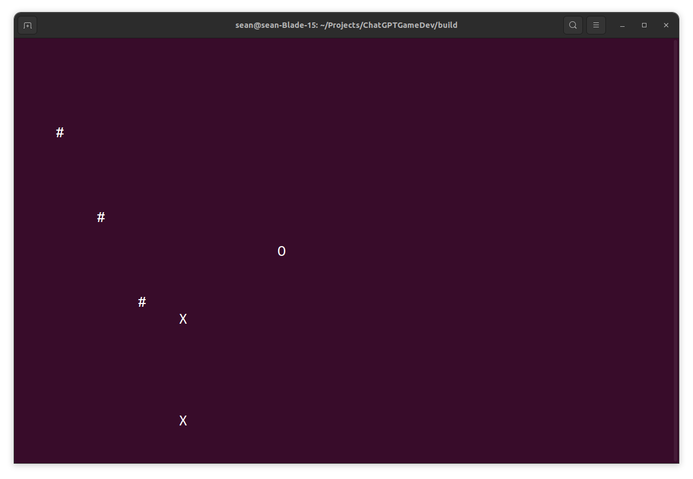

# ChatGPTGameDev

## Prompt01

Given 

"generate a c++ program for a simple video game"

ChatGPT responded as follows...

> Sure, here is an example C++ program for a simple video game using the ncurses library:

~~~cpp
#include <iostream>
#include <ncurses.h>

using namespace std;

int main()
{
    // Initialize ncurses
    initscr();
    noecho();
    curs_set(0);

    // Set up game variables
    int x = 0, y = 0;
    int max_x = 0, max_y = 0;
    int ch = 0;

    // Get screen size
    getmaxyx(stdscr, max_y, max_x);

    // Main game loop
    while (ch != 'q')
    {
        // Clear the screen
        clear();

        // Draw the player character
        mvprintw(y, x, "O");

        // Move the player character based on user input
        switch (ch)
        {
            case KEY_UP:
                if (y > 0)
                    y--;
                break;
            case KEY_DOWN:
                if (y < max_y - 1)
                    y++;
                break;
            case KEY_LEFT:
                if (x > 0)
                    x--;
                break;
            case KEY_RIGHT:
                if (x < max_x - 1)
                    x++;
                break;
        }

        // Refresh the screen
        refresh();

        // Get user input
        ch = getch();
    }

    // Clean up ncurses
    endwin();

    return 0;
}

~~~

> This program uses the ncurses library to create a simple game where the player can move a character around the screen using the arrow keys. The game loop clears the screen, draws the player character at the current position, moves the player character based on user input, and refreshes the screen. The loop continues until the user presses the 'q' key. This is just a simple example, but it could be expanded to include obstacles, enemies, and other game mechanics.

it worked but its not a video game. apart from one line of code missing which was necessary to make ncurses read the arrow keys properly. added necessary code.
its almost as if its the starting code a course might give students to work from an initial shell to get them going.

# Prompt 02

## prompt

"generate a c++ program for a simple video game including obstacles and enemies"

## result 

> Here is an example C++ program for a simple video game that includes obstacles and enemies, using the ncurses library

~~~cpp

#include <iostream>
#include <vector>
#include <ncurses.h>

using namespace std;

// Structs for game objects
struct GameObject
{
    int x, y;
    char symbol;
};

struct Obstacle : public GameObject
{
    Obstacle(int x, int y) { this->x = x; this->y = y; this->symbol = '#'; }
};

struct Enemy : public GameObject
{
    Enemy(int x, int y) { this->x = x; this->y = y; this->symbol = 'X'; }
};

// Function to check for collisions
bool checkCollision(int x1, int y1, int x2, int y2)
{
    return x1 == x2 && y1 == y2;
}

int main()
{
    // Initialize ncurses
    initscr();
    noecho();
    curs_set(0);

    // Set up game variables
    int player_x = 0, player_y = 0;
    int max_x = 0, max_y = 0;
    int ch = 0;

    // Set up obstacles and enemies
    vector<Obstacle> obstacles = { Obstacle(5, 5), Obstacle(10, 10), Obstacle(15, 15) };
    vector<Enemy> enemies = { Enemy(20, 20), Enemy(25, 25), Enemy(30, 30) };

    // Main game loop
    while (ch != 'q')
    {
        // Clear the screen
        clear();

        // Draw the player character
        mvprintw(player_y, player_x, "O");

        // Draw the obstacles
        for (Obstacle obstacle : obstacles)
        {
            mvprintw(obstacle.y, obstacle.x, "#");
            if (checkCollision(player_x, player_y, obstacle.x, obstacle.y))
            {
                // Game over
                mvprintw(max_y/2, max_x/2 - 5, "GAME OVER");
                refresh();
                getch();
                endwin();
                return 0;
            }
        }

        // Draw the enemies
        for (Enemy enemy : enemies)
        {
            mvprintw(enemy.y, enemy.x, "X");
            if (checkCollision(player_x, player_y, enemy.x, enemy.y))
            {
                // Game over
                mvprintw(max_y/2, max_x/2 - 5, "GAME OVER");
                refresh();
                getch();
                endwin();
                return 0;
            }
        }

        // Move the player character based on user input
        switch (ch)
        {
            case KEY_UP:
                if (player_y > 0)
                    player_y--;
                break;
            case KEY_DOWN:
                if (player_y < max_y - 1)
                    player_y++;
                break;
            case KEY_LEFT:
                if (player_x > 0)
                    player_x--;
                break;
            case KEY_RIGHT:
                if (player_x < max_x - 1)
                    player_x++;
                break;
        }

        // Get screen size
        getmaxyx(stdscr, max_y, max_x);

        // Refresh the screen
        refresh();

        // Get user input
        ch = getch();
    }

    // Clean up ncurses
    endwin();

    return 0;
}

~~~

> This program builds on the previous example, adding obstacles and enemies to the game. The obstacles and enemies are stored in vectors of Obstacle and Enemy objects, respectively. The game loop draws the obstacles and enemies on the screen, checks for

( i think maybe it got a bit bored at this point as the text just stopped.)

## Prompt 03

## prompt 

"can you make the enemies move please?"

## result 

~~~cpp

#include <iostream>
#include <vector>
#include <ncurses.h>
#include <cstdlib>
#include <ctime>

using namespace std;

// Structs for game objects
struct GameObject
{
    int x, y;
    char symbol;
};

struct Obstacle : public GameObject
{
    Obstacle(int x, int y) { this->x = x; this->y = y; this->symbol = '#'; }
};

struct Enemy : public GameObject
{
    Enemy(int x, int y) { this->x = x; this->y = y; this->symbol = 'X'; }
};

// Function to check for collisions
bool checkCollision(int x1, int y1, int x2, int y2)
{
    return x1 == x2 && y1 == y2;
}

// Function to move enemies randomly
void moveEnemies(vector<Enemy>& enemies, int max_x, int max_y)
{
    for (Enemy& enemy : enemies)
    {
        int dx = rand() % 3 - 1;
        int dy = rand() % 3 - 1;
        if (enemy.x + dx >= 0 && enemy.x + dx < max_x)
            enemy.x += dx;
        if (enemy.y + dy >= 0 && enemy.y + dy < max_y)
            enemy.y += dy;
    }
}

int main()
{
    // Initialize ncurses
    initscr();
    noecho();
    curs_set(0);

    // Set up game variables
    int player_x = 0, player_y = 0;
    int max_x = 0, max_y = 0;
    int ch = 0;
    srand(time(NULL));  // Seed the random number generator

    // Set up obstacles and enemies
    vector<Obstacle> obstacles = { Obstacle(5, 5), Obstacle(10, 10), Obstacle(15, 15) };
    vector<Enemy> enemies = { Enemy(20, 20), Enemy(25, 25), Enemy(30, 30) };

    // Main game loop
    while (ch != 'q')
    {
        // Clear the screen
        clear();

        // Draw the player character
        mvprintw(player_y, player_x, "O");

        // Draw the obstacles
        for (Obstacle obstacle : obstacles)
        {
            mvprintw(obstacle.y, obstacle.x, "#");
            if (checkCollision(player_x, player_y, obstacle.x, obstacle.y))
            {
                // Game over
                mvprintw(max_y/2, max_x/2 - 5, "GAME OVER");
                refresh();
                getch();
                endwin();
                return 0;
            }
        }

        // Draw the enemies and move them randomly
        moveEnemies(enemies, max_x, max_y);
        for (Enemy enemy : enemies)
        {
            mvprintw(enemy.y, enemy.x, "X");
            if (checkCollision(player_x, player_y, enemy.x, enemy.y))
            {
                // Game over
                mvprintw(max_y/2, max_x/2 - 5, "GAME OVER");
                refresh();
                getch();
                endwin();
                return 0;
            }
        }

        // Move the player character based on user input
        switch (ch)
        {
            case KEY_UP:
                if (player_y > 0)
                    player_y--;
                break;
            case KEY_DOWN:
                if (player_y < max_y - 1)
                    player_y++;
                break;

~~~

at this point ChatGPT stopped. unsure what to do next I remembered its a chat bot, so gave a new prompt...

"continue please"

ChatGPT continued as follows...

> Here's the second half of the modified C++ program:

~~~cpp

        case KEY_LEFT:
            if (player_x > 0)
                player_x--;
            break;
        case KEY_RIGHT:
            if (player_x < max_x - 1)
                player_x++;
            break;
    }

    // Refresh the screen
    refresh();

    // Get the maximum x and y coordinates of the screen
    getmaxyx(stdscr, max_y, max_x);

    // Wait for user input or a short time delay
    ch = getch();
    napms(50);
}

// Clean up ncurses
endwin();

return 0;

~~~

## discussion

Followed by this text, which seems like it comes from some kind of explanation or tutorial.

> In this version, the `moveEnemies` function randomly moves the enemy objects on the screen. The `dx` and `dy` variables determine the direction of the movement, and are set to random values between -1 and 1. The `if` statements ensure that the enemies don't move off the screen.

> Note that the movement of the enemies in this version is quite simple and not very challenging. You can modify the `moveEnemies` function to make the movement more complex and interesting if you like.

As before the line was necessary to make it read the keyboard properly plus for unknown reasons the code was missing the fina bracket which was outside the code block of the chatGPT webpage and the accompanying descriptive text was in a code block. Ho Hum.

with the necessary changes it worked a bit more like a video game now. though it really feels like im working through the exercises from gamedev101. 

## Prompt 04

Given the prompt...

"can you make the enemies chase the player please?"

ChatGPT responded differently.

> Yes, I can modify the C++ program to make the enemies chase the player. Here's a possible modification to the moveEnemies function that implements this behavior:

~~~cpp

void moveEnemies(Enemy enemies[], int num_enemies, int player_x, int player_y) {
    for (int i = 0; i < num_enemies; i++) {
        // Calculate the distance between the enemy and the player
        int dist_x = player_x - enemies[i].x;
        int dist_y = player_y - enemies[i].y;
        int dist = sqrt(dist_x * dist_x + dist_y * dist_y);

        // If the enemy is close to the player, move towards the player
        if (dist < 10) {
            int dx = (dist_x > 0) - (dist_x < 0);
            int dy = (dist_y > 0) - (dist_y < 0);

            // Check if the new position is valid
            if (enemies[i].x + dx >= 0 && enemies[i].x + dx < max_x && 
                enemies[i].y + dy >= 0 && enemies[i].y + dy < max_y) {
                // Update the enemy position
                enemies[i].x += dx;
                enemies[i].y += dy;
            }
        } else {
            // Otherwise, move randomly
            int dx = rand() % 3 - 1;
            int dy = rand() % 3 - 1;

            // Check if the new position is valid
            if (enemies[i].x + dx >= 0 && enemies[i].x + dx < max_x && 
                enemies[i].y + dy >= 0 && enemies[i].y + dy < max_y) {
                // Update the enemy position
                enemies[i].x += dx;
                enemies[i].y += dy;
            }
        }
    }
}

~~~

Rather than generating the entire program again from scratch it has given me an edit to the previous programme. Again however its giving me a litle tutorial on the code generated. We didnt ask for this though so im guessing its generated from text surrounding the code examples it found on the internet.

> In this version, if the distance between an enemy and the player is less than 10 units, the enemy moves towards the player's position. Otherwise, the enemy moves randomly as before. The dx and dy variables are calculated based on the distance between the enemy and the player, and are used to update the enemy's position.

> Note that the chasing behavior implemented here is very simple and can be improved upon. For example, you can add more sophisticated algorithms that take into account obstacles on the screen, or implement different movement patterns for the enemies.

OK, so ive copied the supplied function in and commented out the previous version.

A small but relavent number of errors have been generated and output by the compiler.

~~~
/home/sean/Projects/ChatGPTGameDev/Prompt04/main.cpp: In function ‘void moveEnemies(Enemy*, int, int, int)’:
/home/sean/Projects/ChatGPTGameDev/Prompt04/main.cpp:60:20: error: ‘sqrt’ was not declared in this scope
   60 |         int dist = sqrt(dist_x * dist_x + dist_y * dist_y);
      |                    ^~~~
/home/sean/Projects/ChatGPTGameDev/Prompt04/main.cpp:68:63: error: ‘max_x’ was not declared in this scope
   68 |             if (enemies[i].x + dx >= 0 && enemies[i].x + dx < max_x &&
      |                                                               ^~~~~
/home/sean/Projects/ChatGPTGameDev/Prompt04/main.cpp:69:63: error: ‘max_y’ was not declared in this scope
   69 |                 enemies[i].y + dy >= 0 && enemies[i].y + dy < max_y) {
      |                                                               ^~~~~
/home/sean/Projects/ChatGPTGameDev/Prompt04/main.cpp:80:63: error: ‘max_x’ was not declared in this scope
   80 |             if (enemies[i].x + dx >= 0 && enemies[i].x + dx < max_x &&
      |                                                               ^~~~~
/home/sean/Projects/ChatGPTGameDev/Prompt04/main.cpp:81:63: error: ‘max_y’ was not declared in this scope
   81 |                 enemies[i].y + dy >= 0 && enemies[i].y + dy < max_y) {
      |                                                               ^~~~~
/home/sean/Projects/ChatGPTGameDev/Prompt04/main.cpp: In function ‘int main()’:
/home/sean/Projects/ChatGPTGameDev/Prompt04/main.cpp:139:21: error: cannot convert ‘std::vector<Enemy>’ to ‘Enemy*’
  139 |         moveEnemies(enemies, max_x, max_y);
      |                     ^~~~~~~
      |                     |
      |                     std::vector<Enemy>
/home/sean/Projects/ChatGPTGameDev/Prompt04/main.cpp:55:24: note:   initializing argument 1 of ‘void moveEnemies(Enemy*, int, int, int)’
   55 | void moveEnemies(Enemy enemies[], int num_enemies, int player_x, int player_y) {
      |                  ~~~~~~^~~~~~~~~
~~~

C++ programmers will understand and be able to resolve these errors easily, one is related to an absence of the maths code necessary to calculate distances in 2d the square root. The others are lreated to the generated code itself. The code itself cant refer the limits of movement from these contexts.

We will have to make some minor tweaks. First to add in a reference to the maths code (its pretty standard in all dev environment) and Second to expand the visability of the limits of movement (the max_ variables so they can be seen at this point.) 

